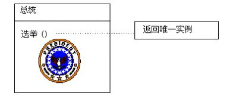

- [单件模式](#单件模式)
    - [概述](#概述)
    - [意图](#意图)
    - [模型图](#模型图)
        - [逻辑模型图](#逻辑模型图)
        - [物理模型图](#物理模型图)
    - [生活中的例子](#生活中的例子)
    - [五种实现](#五种实现)
        - [1. 简单实现](#1-简单实现)
        - [2. 安全的线程](#2-安全的线程)
        - [3. 双重锁定](#3-双重锁定)
        - [4．静态初始化](#4．静态初始化)
        - [5．延迟初始化(推荐)](#5．延迟初始化推荐)
    - [实现要点](#实现要点)
    - [优点](#优点)
    - [缺点](#缺点)
    - [适用性](#适用性)
    - [应用场景](#应用场景)
    - [完整示例](#完整示例)
    - [总结](#总结)

# 单件模式

## 概述

Singleton模式要求**一个类有且仅有一个实例**，并且提供了一个全局的访问点。这就提出了一个问题：如何绕过常规的构造器，提供一种机制来保证一个类只有一个实例？客户程序在调用某一个类时，它是不会考虑这个类是否只能有一个实例等问题的，所以，**这应该是类设计者的责任，而不是类使用者的责任。**

从另一个角度来说，Singleton模式其实也是一种**职责型模式**。因为我们创建了一个对象，这个对象扮演了独一无二的角色，在这个单独的对象实例中，它集中了它所属类的所有权力，同时它也肩负了行使这种权力的职责！

## 意图

保证一个类仅有一个实例，并提供一个访问它的**全局访问点**。

## 模型图

### 逻辑模型图


### 物理模型图


## 生活中的例子

美国总统的职位是`Singleton`,美国宪法规定了总统的选举，任期以及继任的顺序。这样，在任何时刻只能由一个现任的总统。无论现任总统的身份为何，其头衔"美利坚合众国总统"是访问这个职位的人的一个全局的访问点。



## 五种实现

### 1. 简单实现

```csharp
public sealed class Singleton
{
    static Singleton instance=null; // 静态变量

    Singleton() // 关闭构造函数对外访问权限
    {
    }

    public static Singleton Instance // 提供唯一访问点
    {
        get
        {
            if (instance==null) // 限制只实例化一次，但这里不支持多线程
            {
                instance = new Singleton();
            }
            return instance;
        }
    }
}
```

> 这种方式的实现**对于线程来说并不是安全的**，因为在多线程的环境下有**可能**得到Singleton类的**多个实例**。如果同时有两个线程去判断（instance == null），并且得到的结果为真，这时两个线程都会创建类Singleton的实例，这样就违背了Singleton模式的原则。实际上在上述代码中，有可能在计算出表达式的值之前，对象实例已经被创建，但是内存模型并不能保证对象实例在第二个线程创建之前被发现。

该实现方式主要有两个优点：

- 由于实例是在 Instance 属性方法内部创建的，因此**类可以使用附加功能**（例如，对子类进行实例化），即使它可能引入不想要的依赖性。

- 直到对象要求产生一个实例才执行实例化；这种方法称为“惰性实例化”。惰性实例化避免了在应用程序启动时实例化不必要的 singleton。

### 2. 安全的线程

```csharp
public sealed class Singleton
{
    static Singleton instance=null;
    static readonly object padlock = new object();

    Singleton()
    {
    }

    public static Singleton Instance
    {
        get
        {
            lock (padlock) // 每次都要锁一次，很费性能
            {
                if (instance==null)
                {
                    instance = new Singleton();
                }
                return instance;
            }
        }
    }
}
```

> 这种方式的实现对于线程来说是安全的。我们首先创建了一个进程辅助对象，线程在进入时先对辅助对象加锁然后再检测对象是否被创建，这样可以确保只有一个实例被创建，因为在同一个时刻加了锁的那部分程序只有一个线程可以进入。这种情况下，对象实例由最先进入的那个线程创建，后来的线程在进入时（instence == null）为假，不会再去创建对象实例了。**但是这种实现方式增加了额外的开销，损失了性能。**

### 3. 双重锁定

```csharp
public sealed class Singleton
{
    static Singleton instance=null;
    static readonly object padlock = new object();

    Singleton()
    {
    }

    public static Singleton Instance
    {
        get
        {
            if (instance==null) // 外层判断减少锁的次数，实例化就不会锁了。但多个线程倒霉催的都进入锁了，那还是会卡在这个锁。
            {
                lock (padlock)
                {
                    if (instance==null)
                    {
                        instance = new Singleton();
                    }
                }
            }
            return instance;
        }
    }
}
```

> 这种实现方式对多线程来说是安全的，同时线程不是每次都加锁，只有判断对象实例没有被创建时它才加锁，有了我们上面第一部分的里面的分析，我们知道，加锁后还得再进行对象是否已被创建的判断。它解决了线程并发问题，同时避免在每个 Instance 属性方法的调用中都出现独占锁定。它还允许您将实例化延迟到第一次访问对象时发生。实际上，应用程序很少需要这种类型的实现。大多数情况下我们会用静态初始化。这种方式仍然有很多缺点：无法实现延迟初始化。

### 4．静态初始化

```csharp
public sealed class Singleton // sealed 不可继承
{
    static readonly Singleton instance=new Singleton(); // 只读静态初始化，加载dll就初始化了。由公共语言运行库(clr)控制

    static Singleton()
    {
    }

    Singleton()
    {
    }

    public static Singleton Instance
    {
        get
        {
            return instance;
        }
    }
}
```

> 看到上面这段富有戏剧性的代码，我们可能会产生怀疑，这还是Singleton模式吗？在此实现中，将在第一次引用类的任何成员时创建实例。公共语言运行库负责处理变量初始化。该类标记为 sealed 以阻止发生派生，而派生可能会增加实例。此外，变量标记为 readonly，这意味着只能在静态初始化期间（此处显示的示例）或在类构造函数中分配变量。<br />该实现与前面的示例类似，不同之处在于它依赖公共语言运行库来初始化变量。它仍然可以用来解决 Singleton 模式试图解决的两个基本问题：全局访问和实例化控制。公共静态属性为访问实例提供了一个全局访问点。此外，由于构造函数是私有的，因此不能在类本身以外实例化 Singleton 类；因此，变量引用的是可以在系统中存在的唯一的实例。<br />由于 Singleton 实例被私有静态成员变量引用，因此在类首次被对 Instance 属性的调用所引用之前，不会发生实例化。<br />这种方法唯一的潜在缺点是，您对实例化机制的控制权较少。在 Design Patterns 形式中，您能够在实例化之前使用非默认的构造函数或执行其他任务。由于在此解决方案中由 .NET Framework 负责执行初始化，因此您没有这些选项。在大多数情况下，静态初始化是在 .NET 中实现 Singleton 的首选方法。

### 5．延迟初始化(推荐)

```cs
public sealed class Singleton
{
    Singleton()
    {
    }

    public static Singleton Instance
    {
        get
        {
            return Nested.instance;
        }
    }
    
    class Nested
    {
        static Nested()
        {
        }

        internal static readonly Singleton instance = new Singleton();
    }
}
```

> 这里，初始化工作有Nested类的一个静态成员来完成，这样就实现了延迟初始化，并具有很多的优势，是值得推荐的一种实现方式。

## 实现要点

- Singleton模式是限制而不是改进类的创建。

- Singleton类中的实例构造器可以设置为Protected以允许子类派生。

- Singleton模式一般不要支持Icloneable接口，因为这可能导致多个对象实例，与Singleton模式的初衷违背。

- Singleton模式一般不要支持序列化，这也有可能导致多个对象实例，这也与Singleton模式的初衷违背。

- Singleton只考虑了对象创建的管理，没有考虑到销毁的管理，就支持垃圾回收的平台和对象的开销来讲，我们一般没必要对其销毁进行特殊的管理。

- 理解和扩展Singleton模式的核心是“如何控制用户使用new对一个类的构造器的任意调用”。

- 可以很简单的修改一个Singleton，使它有少数几个实例，这样做是允许的而且是有意义的。

## 优点

- 实例控制：Singleton 会阻止其他对象实例化其自己的 Singleton 对象的副本，从而确保所有对象都访问唯一实例

- 灵活性：因为类控制了实例化过程，所以类可以更加灵活修改实例化过程

## 缺点

- 开销：虽然数量很少，但如果每次对象请求引用时都要检查是否存在类的实例，将仍然需要一些开销。可以通过使用静态初始化解决此问题，上面的五种实现方式中已经说过了。

-  可能的开发混淆：使用 singleton 对象（尤其在类库中定义的对象）时，开发人员必须记住自己不能使用 new 关键字实例化对象。因为可能无法访问库源代码，因此应用程序开发人员可能会意外发现自己无法直接实例化此类。

- 对象的生存期：Singleton 不能解决删除单个对象的问题。在提供内存管理的语言中（例如基于 .NET Framework 的语言），只有 Singleton 类能够导致实例被取消分配，因为它包含对该实例的私有引用。在某些语言中（如 C++），其他类可以删除对象实例，但这样会导致Singleton 类中出现悬浮引用。

## 适用性

- 当类只能有一个实例而且客户可以从一个众所周知的访问点访问它时。

- 当这个唯一实例应该是通过子类化可扩展的，并且客户应该无需更改代码就能使用一个扩展的实例时。

## 应用场景

- 每台计算机可以有若干个打印机，但只能有一个Printer Spooler，避免两个打印作业同时输出到打印机。 （摘自吕震宇的C#设计模式（7）－Singleton Pattern）

- PC机中可能有几个串口，但只能有一个COM1口的实例。

- 系统中只能有一个窗口管理器。

- .NET Remoting中服务器激活对象中的Sigleton对象，确保所有的客户程序的请求都只有一个实例来处理。

## 完整示例

这是一个简单的计数器例子，四个线程同时进行计数。

```cs
using System; 
using System.Threading; 
 
namespace SigletonPattern.SigletonCounter 
{ 
    /// <summary> 
    /// 功能：简单计数器的单件模式 
    /// 编写：Terrylee 
    /// 日期：2005年12月06日 
    /// </summary> 
    public class CountSigleton 
    { 
        ///存储唯一的实例 
        static CountSigleton uniCounter = new CountSigleton();   
    
        ///存储计数值 
        private int totNum = 0;   
    
        private CountSigleton()    
        {
            ///线程延迟2000毫秒 
            Thread.Sleep(2000); 
        }  
    
        static public CountSigleton Instance()   
        {    
            return uniCounter;    
        }  
         
        ///计数加1 
        public void Add() 
        {  
            totNum ++; 
        }   
         
        ///获得当前计数值 
        public int GetCounter() 
        {  
            return totNum; 
        }  
 
    } 
} 


using System;
using System.Threading;
using System.Text;

namespace SigletonPattern.SigletonCounter
{
    /// <summary>
    /// 功能：创建一个多线程计数的类
    /// 编写：Terrylee
    /// 日期：2005年12月06日
    /// </summary>
    public class CountMutilThread
    {
        public CountMutilThread()
        {
            
        }

        /// <summary>
        /// 线程工作
        /// </summary>
        public static void DoSomeWork()
        {
            ///构造显示字符串
            string results = "";

            ///创建一个Sigleton实例
            CountSigleton MyCounter = CountSigleton.Instance();

            ///循环调用四次
            for(int i=1;i<5;i++)
            {
                ///开始计数
                MyCounter.Add();
                
                results +="线程";
                results += Thread.CurrentThread.Name.ToString() + "——〉";
                results += "当前的计数：";
                results += MyCounter.GetCounter().ToString();
                results += "\n";

                Console.WriteLine(results);
                
                ///清空显示字符串
                results = "";
            }
        }

        public void StartMain()
        {

            Thread thread0 = Thread.CurrentThread;    
            thread0.Name = "Thread 0"; 
   
            Thread thread1 =new Thread(new ThreadStart(DoSomeWork));    
            thread1.Name = "Thread 1"; 
   
            Thread thread2 =new Thread(new ThreadStart(DoSomeWork));    
            thread2.Name = "Thread 2"; 
   
            Thread thread3 =new Thread(new ThreadStart(DoSomeWork));    
            thread3.Name = "Thread 3"; 
   
            thread1.Start();    
            thread2.Start(); 
            thread3.Start(); 
            
            ///线程0也只执行和其他线程相同的工作
            DoSomeWork(); 
        }
    }
}


using System; 
using System.Text; 
using System.Threading; 
 
namespace SigletonPattern.SigletonCounter 
{ 
    /// <summary> 
    /// 功能：实现多线程计数器的客户端 
    /// 编写：Terrylee 
    /// 日期：2005年12月06日 
    /// </summary> 
    public class CountClient 
    { 
        public static void Main(string[] args) 
        { 
            CountMutilThread cmt = new CountMutilThread(); 
 
            cmt.StartMain(); 
 
            Console.ReadLine(); 
        } 
    } 
} 

``` 

## 总结

Singleton设计模式是一个非常有用的机制，可用于在面向对象的应用程序中提供单个访问点。文中通过五种实现方式的比较和一个完整的示例，完成了对Singleton模式的一个总结和探索。用一句广告词来概括Singleton模式就是“简约而不简单”。

---
源码下载：[SigletonPattern.rar](http://files.cnblogs.com/Terrylee/SigletonPattern.rar)

参考文献：

《C#计模式》，中国电力出版社

使用 Microsoft .NET 的企业解决方案模式

[《Implementing the Singleton Pattern in C#》](http://www.yoda.arachsys.com/csharp/singleton.html)

MSDN[《Exploring the Singleton Design Pattern》](http://msdn.microsoft.com/library/default.asp?url=/library/en-us/dnbda/html/singletondespatt.asp)

[吕震宇C#设计模式（7）－Singleton Pattern](http://zhenyulu.cnblogs.com/articles/37246.html)

[C#的Singleton设计模式](http://huqingyu.cnblogs.com/archive/2004/07/09/22721.html)
